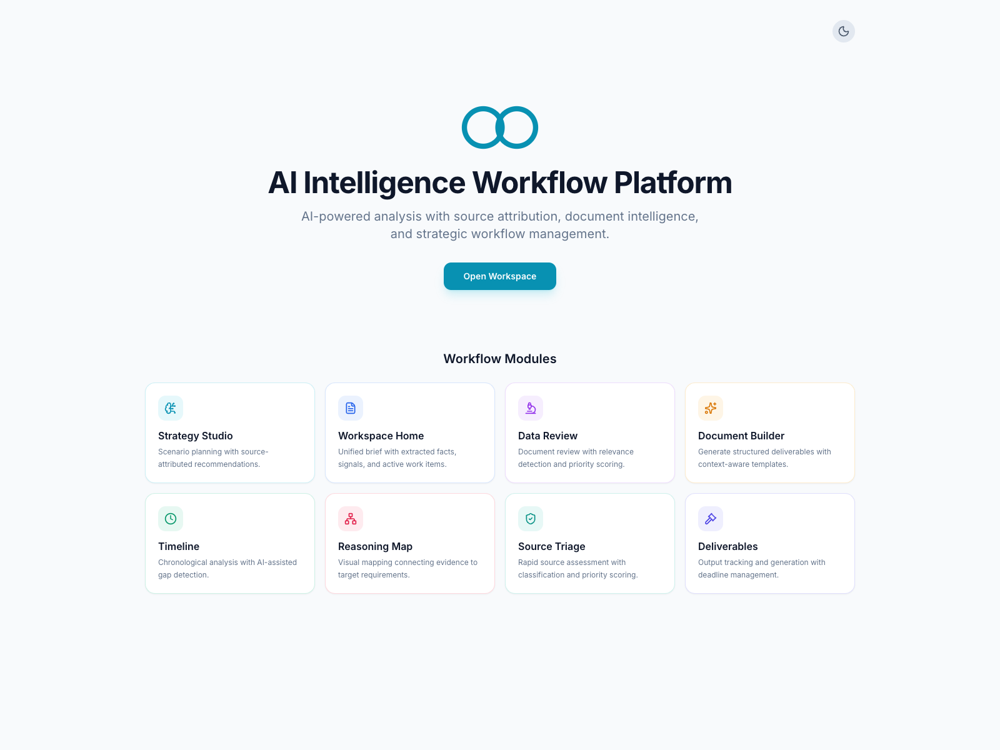
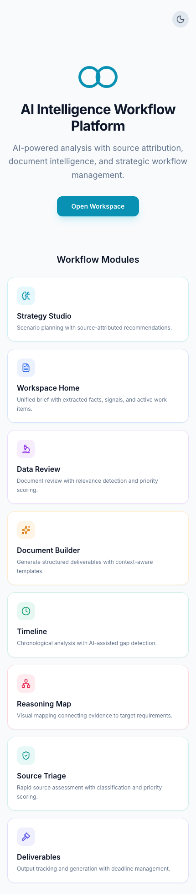

# AI Intelligence Workflow

Public documentation derived from a private AI platform codebase.

## Ownership

- solo architecture and implementation
- no team attribution in this portfolio repository

## Scope

- no private source code
- no client or domain identifiers
- no proprietary algorithms or internal schemas
- only verified claims

## Verified Snapshot

Source repository checked: private source repository  
Commit: `cf855f6`  
Verification date: `2026-02-18`

| Metric | Current Value |
| --- | --- |
| Frontend route definitions | 24 |
| Sidebar navigation modules | 13 |
| Backend route files (`server/src/routes`) | 25 |
| Backend route handlers (`router.get/post/put/patch/delete`) | 151 |
| Prisma models | 49 |
| Prisma migrations | 22 |
| Service-layer TypeScript files | 37 |
| Frontend component files (`.tsx`) | 87 |

## Visual Walkthrough

- [`docs/VISUAL-WALKTHROUGH.md`](docs/VISUAL-WALKTHROUGH.md)
- [`docs/SYSTEMS-ARCHITECTURE.md`](docs/SYSTEMS-ARCHITECTURE.md)

## Drift Check

- [`docs/ARCHITECTURE-DRIFT-CHECK.md`](docs/ARCHITECTURE-DRIFT-CHECK.md)

## Repository Contents

- [`docs/SYSTEMS-ARCHITECTURE.md`](docs/SYSTEMS-ARCHITECTURE.md)
- [`docs/VISUAL-WALKTHROUGH.md`](docs/VISUAL-WALKTHROUGH.md)
- [`docs/ARCHITECTURE-DRIFT-CHECK.md`](docs/ARCHITECTURE-DRIFT-CHECK.md)
- [`docs/SKILLS-EVIDENCE-MATRIX.md`](docs/SKILLS-EVIDENCE-MATRIX.md)
- [`docs/CASE-STUDY-TEMPLATE.md`](docs/CASE-STUDY-TEMPLATE.md)
- [`docs/PORTFOLIO_EXTRACTION_PLAYBOOK.md`](docs/PORTFOLIO_EXTRACTION_PLAYBOOK.md)
- [`docs/PRIVACY_IP_GUARDRAILS.md`](docs/PRIVACY_IP_GUARDRAILS.md)
- [`scripts/architecture_snapshot.sh`](scripts/architecture_snapshot.sh)
- [`scripts/sanity_check_portfolio.sh`](scripts/sanity_check_portfolio.sh)

## Update Workflow

1. Refresh counts from private source with `scripts/architecture_snapshot.sh`.
2. Update architecture or case-study docs.
3. Verify every claim has a measurement source.
4. Copy `.portfolio-sensitive-terms.example.txt` to `.portfolio-sensitive-terms.txt` and add private terms.
5. Run `./scripts/sanity_check_portfolio.sh .`.
6. Review the diff for disclosure risk before publish.
