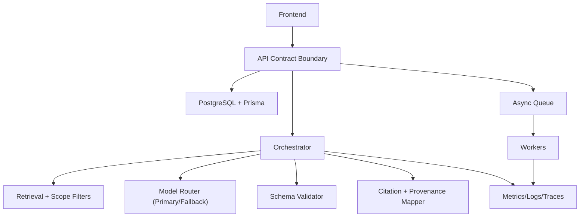

# AI Intelligence Workflow

Public documentation artifact for a private AI platform, built to show production engineering rigor without exposing proprietary code or client data.

## Problem. Approach. Proof.

- **Problem:** Multi-stage LLM workflows can fail silently through schema drift, weak provenance, and poor operational traceability.
- **Approach:** A contract-first orchestration architecture with strict schema gates, retrieval scoping, citation mapping, telemetry, and fallback control paths.
- **Proof:** Public-safe architecture docs, proving-ground contracts, reproducible snapshot artifacts, and measured case studies.

## What This Is

This repository is a clean-room public dossier derived from a private TypeScript codebase.
It focuses on architecture, controls, and outcomes that are externally reviewable while private implementation details remain out of scope.

## What It Proves

- production topology and control boundaries for AI orchestration: [`docs/SYSTEMS-ARCHITECTURE.md`](docs/SYSTEMS-ARCHITECTURE.md)
- contract behavior at edge, generation, and persistence layers: [`docs/PROVING-GROUNDS.md`](docs/PROVING-GROUNDS.md)
- concrete request/schema/provenance contract examples (synthetic but executable in shape): [`docs/REQUEST_CONTRACTS_AND_SCHEMAS.md`](docs/REQUEST_CONTRACTS_AND_SCHEMAS.md)
- explicit SLO and failure-budget posture: [`docs/SLOS-AND-FAILURE-BUDGETS.md`](docs/SLOS-AND-FAILURE-BUDGETS.md)
- privacy, retention, tenant-boundary, and vendor-risk posture: [`docs/PRIVACY_IP_GUARDRAILS.md`](docs/PRIVACY_IP_GUARDRAILS.md)
- measured outcomes across reliability, retrieval quality, and cost/resilience: case studies in [`docs/INDEX.md`](docs/INDEX.md)

## Architecture At A Glance

## Operational Reality

- **p95 latency SLO:** `<= 6.0s` for synchronous generation path
- **schema-valid response SLO:** `>= 97%`
- **citation resolution SLO:** `>= 99%`
- **error-budget policy:** fallback routing and feature degradation activate when burn rate exceeds threshold
- **failure classes covered:** schema-invalid output, provider timeouts/5xx, low-signal retrieval, unresolved citations, duplicate async jobs

Details: [`docs/SLOS-AND-FAILURE-BUDGETS.md`](docs/SLOS-AND-FAILURE-BUDGETS.md)

## Verified Snapshot (Public-Safe)

Private source reference (for chronology only):

- Source repository: private
- Commit: `cf855f6`
- Verification date: `2026-02-18`

Public verification artifacts:

- command log + snapshot output: [`docs/snapshots/architecture_snapshot_2026-02-18.md`](docs/snapshots/architecture_snapshot_2026-02-18.md)
- redacted route-family inventory: [`docs/snapshots/route_inventory_2026-02-18.md`](docs/snapshots/route_inventory_2026-02-18.md)
- redacted schema-category inventory: [`docs/snapshots/schema_inventory_2026-02-18.md`](docs/snapshots/schema_inventory_2026-02-18.md)

| Metric | Current Value |
| --- | --- |
| Frontend route definitions | 24 |
| Sidebar navigation modules | 13 |
| Backend route files (`server/src/routes`) | 25 |
| Backend route handlers (`router.get/post/put/patch/delete`) | 151 |
| Prisma models | 49 |
| Prisma migrations | 22 |
| Service-layer TypeScript files | 37 |
| Frontend component files (`.tsx`) | 87 |

## Evidence Map

See full navigation index: [`docs/INDEX.md`](docs/INDEX.md)

| Evidence Need | Artifact |
| --- | --- |
| Topology and boundaries | [`docs/SYSTEMS-ARCHITECTURE.md`](docs/SYSTEMS-ARCHITECTURE.md) |
| Contracts and incident behavior | [`docs/PROVING-GROUNDS.md`](docs/PROVING-GROUNDS.md) |
| Request DTO/schema/provenance examples | [`docs/REQUEST_CONTRACTS_AND_SCHEMAS.md`](docs/REQUEST_CONTRACTS_AND_SCHEMAS.md) |
| SLOs and failure budgets | [`docs/SLOS-AND-FAILURE-BUDGETS.md`](docs/SLOS-AND-FAILURE-BUDGETS.md) |
| Drift and claim currency | [`docs/ARCHITECTURE-DRIFT-CHECK.md`](docs/ARCHITECTURE-DRIFT-CHECK.md) |
| Privacy/IP and data handling | [`docs/PRIVACY_IP_GUARDRAILS.md`](docs/PRIVACY_IP_GUARDRAILS.md) |
| Delivery outcomes | [`docs/CASE-STUDY-INTELLIGENCE-BRIEF.md`](docs/CASE-STUDY-INTELLIGENCE-BRIEF.md), [`docs/CASE-STUDY-RETRIEVAL-QUALITY.md`](docs/CASE-STUDY-RETRIEVAL-QUALITY.md), [`docs/CASE-STUDY-COST-RESILIENCE.md`](docs/CASE-STUDY-COST-RESILIENCE.md) |
| Visual proof (sanitized) | [`docs/VISUAL-WALKTHROUGH.md`](docs/VISUAL-WALKTHROUGH.md), [`docs/VISUAL-WALKTHROUGH-AUTHENTICATED.md`](docs/VISUAL-WALKTHROUGH-AUTHENTICATED.md) |

## Visual Walkthrough

## Update + Safety Workflow

1. Refresh private metrics with `scripts/architecture_snapshot.sh <private-repo-path>`.
2. Add a new dated public-safe snapshot in `docs/snapshots/`.
3. Update architecture, proving-ground, and case-study docs if claims changed.
4. Run `./scripts/sanity_check_portfolio.sh .`.
5. Install hooks once with `./scripts/install_git_hooks.sh`.
6. Ensure CI `Portfolio Sanity Check` passes in `.github/workflows/sanity-check.yml`.
7. Review the diff for disclosure risk before publish.

## Why Source Code Is Not Public

The production codebase includes client-sensitive workflows, proprietary routing/ranking logic, and private schemas.
This repository intentionally publishes evidence of engineering quality without publishing private implementation internals.
