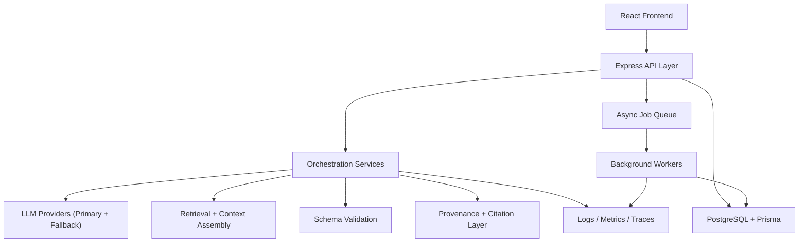
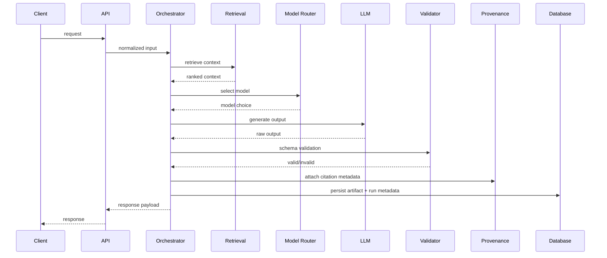

# System Architecture

Verified against private codebase commit `cf855f6` on `2026-02-18`.

## Runtime Topology

## Synchronous Request Path

## Asynchronous Processing Path

```mermaid
flowchart LR
    U["User Upload / Trigger"] --> X["API Endpoint"]
    X --> J["Create Job Record"]
    J --> Q["Queue Publish"]
    Q --> W["Worker Pull"]
    W --> S["Processing Stage Pipeline"]
    S --> C["Context + Analysis Updates"]
    C --> R["Recalibration Signals"]
    R --> P["Persistence"]
    P --> T["Telemetry"]
```

## Control Boundaries

| Boundary | Enforced By |
| --- | --- |
| request contract | endpoint validation + typed DTOs |
| generation contract | schema validation gate |
| retrieval scope | scoped query filters |
| model fallback | provider routing logic |
| export safety | provenance/citation checks |
| operational visibility | logs + metrics + trace events |

## Current Build Snapshot

| Area | Count |
| --- | --- |
| frontend routes | 24 |
| sidebar modules | 13 |
| backend route files | 25 |
| backend route handlers | 151 |
| service files | 37 |
| prisma models | 49 |
| prisma migrations | 22 |
| frontend components | 87 |

## Disclosure Boundaries

- omit private corpus details
- omit proprietary ranking/routing heuristics
- omit private schemas and identifiers
- omit private repository source code
