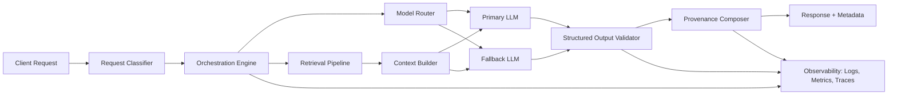

# Systems Architecture (Sanitized)

## Purpose

This document explains the architecture and operating model of the AI platform in a public-safe way. It focuses on engineering decisions, not sensitive domain specifics.

## Design Goals

- reliable AI orchestration under production load
- traceable outputs with source-aware provenance
- predictable downstream integration via structured contracts
- controlled cost/latency through model routing and fallback logic
- safe collaboration between engineering and domain experts

## High-Level Flow

## Core Components

1. Request Classifier
- tags request intent, complexity, and risk profile
- determines orchestration path

2. Orchestration Engine
- coordinates routing, retrieval, validation, fallback, and error handling
- enforces workflow contracts between components

3. Model Router
- chooses model/provider based on task shape, cost budget, latency objectives, and quality thresholds
- supports provider fallback for resilience

4. Retrieval Pipeline
- performs indexing, search, ranking, and context filtering
- hands clean, scoped context to generation stage

5. Structured Output Validator
- verifies schema conformance before response leaves system
- rejects malformed output and triggers retries or fallback paths

6. Provenance Composer
- attaches evidence lineage (source IDs, retrieval metadata, confidence hints)
- enables explainability for users and reviewers

7. Observability Layer
- captures traces, error classes, throughput, latency, and fallback rates
- supports performance tuning and incident response

## Reliability Patterns

- timeout budgets per stage
- circuit-breaker style fallback between model providers
- retry policies with bounded attempts
- schema validation gates before final response
- dead-letter path for non-recoverable failures

## Security and Privacy Patterns (Public-Safe Summary)

- strict separation of prompt orchestration and sensitive data sources
- scoped access to retrieval indexes
- no raw private dataset exposure in public documentation
- redaction-first logging approach for potentially sensitive payloads

## What Is Intentionally Omitted

- domain-specific rules and terminology
- private retrieval corpus details
- proprietary ranking/routing heuristics
- customer or record-level data patterns
- code-level implementation details from the private repo

## What Hiring Teams Can Evaluate Here

- architecture quality and system decomposition
- reasoning about AI reliability in production
- tradeoff management across cost/quality/latency/safety
- ability to design for traceability and operational maturity
