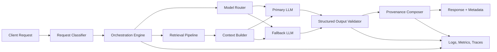

# System Architecture

## Scope

Architecture and operating pattern summary for public review.

## Request Flow

## Components

| Component | Responsibility |
| --- | --- |
| Request Classifier | Classifies intent and selects orchestration path |
| Orchestration Engine | Coordinates routing, retrieval, validation, and error paths |
| Model Router | Selects primary/fallback model by constraints |
| Retrieval Pipeline | Search, rank, and filter context |
| Context Builder | Assembles model input context |
| Structured Output Validator | Enforces output schema |
| Provenance Composer | Adds source and processing metadata |
| Observability Layer | Records traces, metrics, and errors |

## Control Points

- model/provider routing
- retrieval ranking and context filters
- schema validation gate
- fallback and retry path
- provenance attachment
- stage-level telemetry

## Reliability Controls

- timeout budget per stage
- bounded retry policy
- primary-to-fallback provider path
- dead-letter path for unrecoverable failures

## Disclosure Boundaries

- omit private corpus details
- omit proprietary ranking/routing heuristics
- omit private schemas and identifiers
- omit private repository source code
