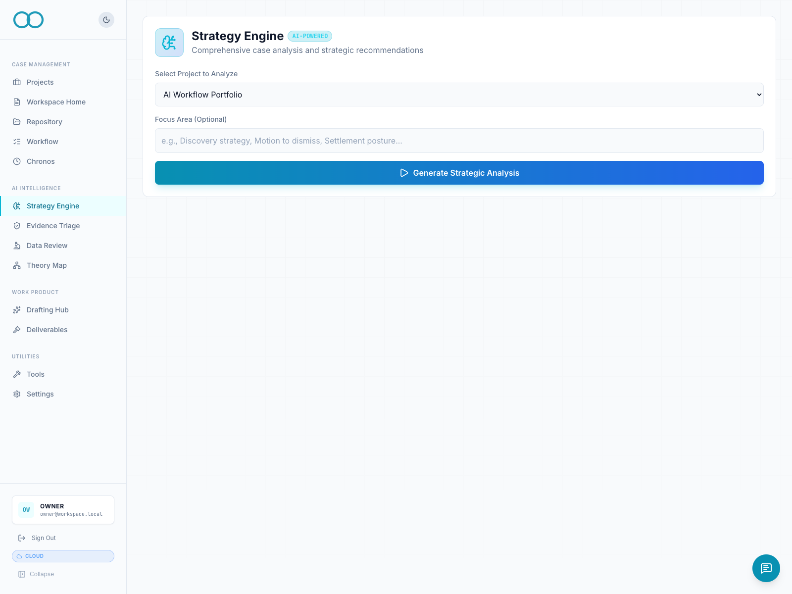
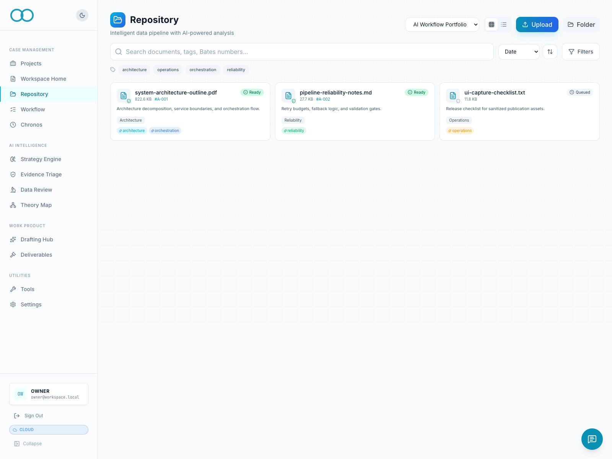
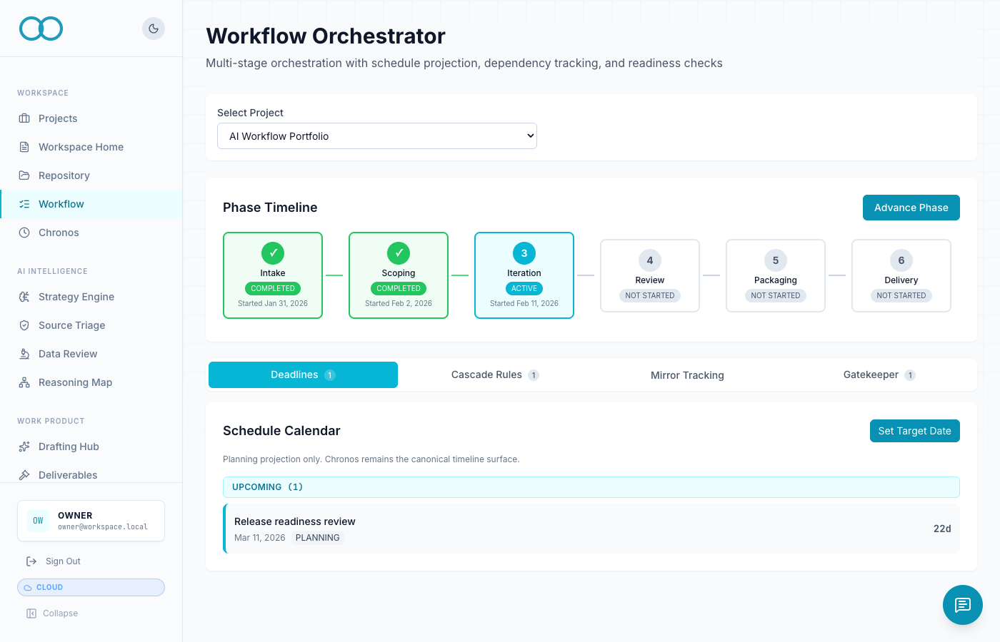
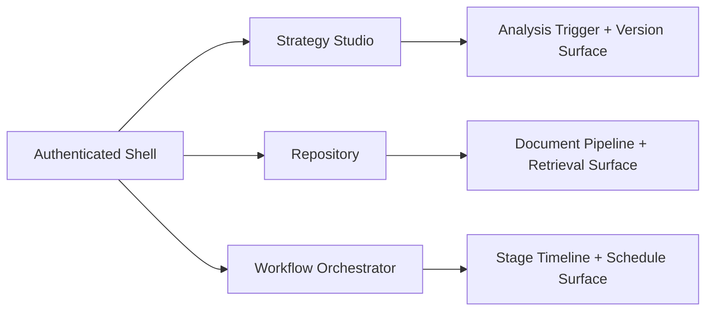
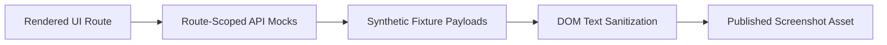

# Authenticated Visual Walkthrough

Verified against private codebase commit `cf855f6` on `2026-02-18`.

All images in this document are sanitized authenticated UI captures rendered from the private application with mocked auth and fixture data.

## Strategy Studio

## Repository

## Workflow Orchestrator

## Module Surface Map

## Capture Boundary

