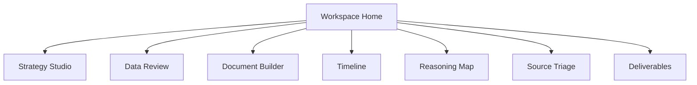
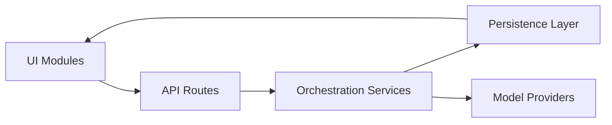

# Visual Walkthrough

Verified against private codebase commit `cf855f6` on `2026-02-18`.

All images in this document are sanitized render captures from the private application UI.

Authenticated module renders: [`docs/VISUAL-WALKTHROUGH-AUTHENTICATED.md`](VISUAL-WALKTHROUGH-AUTHENTICATED.md)

## Desktop View

## Mobile View

## UI Module Map

## Runtime Interaction Map

